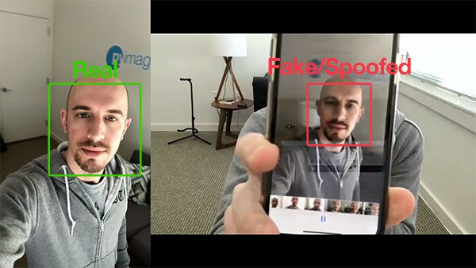

## Liveness detection 

## Brief about our project
    Liveness detection in biometrics is the system's ability to detect face is real from a live person present at the capture point or is fake, and it consists of a set of technical features to counter biometric spoofing attacks, in which a person's biometrics are used. 

